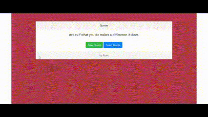
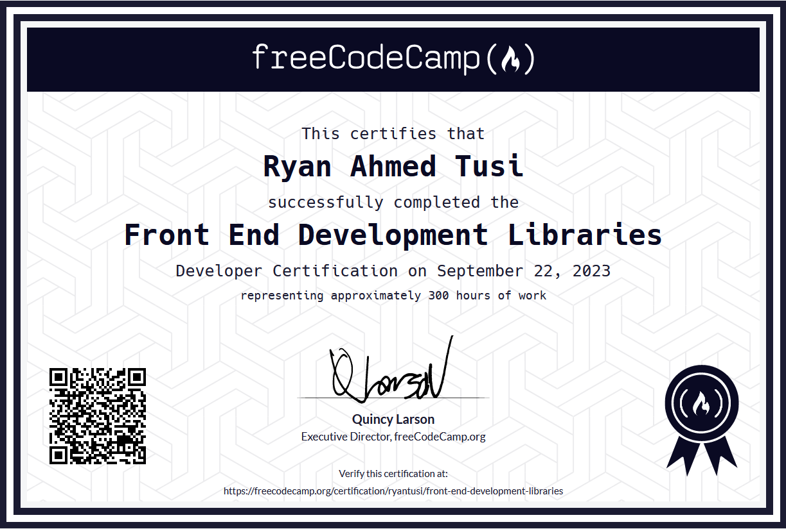

# Frontend Development Libraries 💻

Welcome to my Frontend Development Libraries repository! 🚀 This collection includes projects from the FreeCodeCamp course on "Front End Development Libraries," for which I've earned certification 🎓

## Projects Overview: 🔍
 
### Random Quote Machine

The Random Quote Machine project dynamically displays random quotes fetched. Users can interact with the app to generate new quotes and share them which directs them to their twitter handle with prewritten quote.

### Markdown Previewer

The Markdown Previewer allows users to input Markdown syntax and instantly see a live preview of the rendered output. It helps users visualize how their Markdown content will appear.

### Drum Machine

The Drum Machine simulates a musical instrument interface. Users can play drum sounds by clicking on the provided buttons or by using keyboard shortcuts.

### JavaScript Calculator

The JavaScript Calculator performs basic arithmetic operations. It provides a user-friendly interface for performing calculations, complete with mathematical functionality.

## Technologies Used:
- HTML5
- CSS3
- JavaScript
- Bootstrap
- React (if applicable)

Feel free to explore each project in detail within their respective folders. Each project includes its own set of code files and resources.

## About FreeCodeCamp Certification:

[FreeCodeCamp](https://www.freecodecamp.org/certification/ryantusi/front-end-development-libraries) is an interactive learning platform that offers free coding courses and projects to help individuals learn web development and other programming skills. The Frontend Development Libraries course teaches HTML, CSS, Javascript, React, Redux, Saas, and Bootstrap.

Enjoy exploring these projects! Feel free to reach out for any questions or feedback. 🌟

